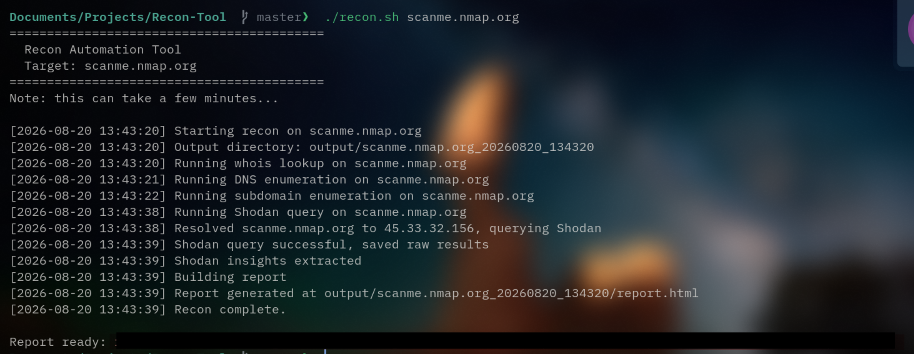
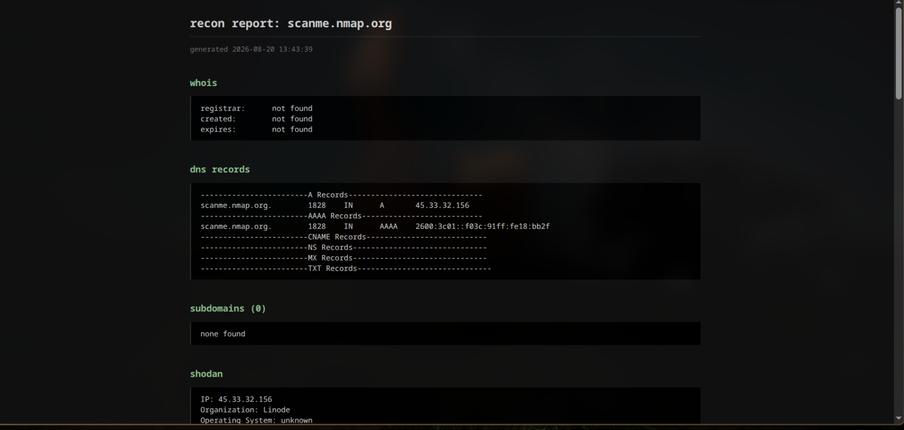

```markdown
# Recon Automation Tool

A bash script that automates passive domain reconnaissance — whois lookup,
DNS enumeration, subdomain discovery, and Shodan exposure checks — and puts
everything into one clean HTML report instead of scattered terminal output.

I built this to stop manually running the same handful of recon commands
every time I looked into a domain, then copy-pasting results into a notes
file. Now it's one command and I get a report I can actually read (or show
someone).

## Tech used

- Bash
- `whois`, `dig`, `curl`, `jq` (standard recon/networking CLI tools)
- [subfinder](https://github.com/projectdiscovery/subfinder) for subdomain discovery
- [Shodan API](https://www.shodan.io) for exposure/open port data
- Plain HTML + CSS for the report (no frameworks, no JS)

## What it checks

- WHOIS — registrar, creation date, expiry date
- DNS records — A, AAAA, CNAME, NS, MX, TXT
- Subdomains — via subfinder
- Shodan — open ports, service banners, known CVEs on the resolved IP

## Screenshots

**Terminal output while scanning:**



**Generated HTML report:**




## Why scanme.nmap.org in the example

The screenshot above is from a scan against `scanme.nmap.org`, which is a
host Nmap's team runs specifically so people can test scanning tools
against it. I used it for the demo instead of a random company's domain
since it's the standard safe target for this kind of thing — no permission
issues, no risk of it looking like I scanned something I shouldn't have.

## Setup

### 1. Clone the repo

```bash
git clone <your-repo-url>
cd Recon-Tool
```

### 2. Install dependencies

```bash
chmod +x setup.sh
./setup.sh
```

This installs `whois`, `dig`, `jq`, and `curl` using your system's package
manager (apt, dnf, or pacman — it auto-detects which one you have), and
installs `subfinder` via Go.

If you don't have Go installed, `setup.sh` will tell you — install it from
[go.dev/doc/install](https://go.dev/doc/install), then run `setup.sh` again.

### 3. Get a Shodan API key

The Shodan lookup is a core part of this tool, so you'll need a key:

1. Go to [shodan.io](https://www.shodan.io) and create a free account
2. Once logged in, go to your account page — your API key is shown right there
3. Copy it

### 4. Add your API key to the project

```bash
cp .env.example .env
```

Open `.env` in any text editor and paste your key in:

```
SHODAN_API_KEY=paste_your_key_here
```

Save the file. The script reads this automatically every time it runs —
you don't need to export anything manually or edit any other files.

### 5. Make the main script executable

```bash
chmod +x recon.sh
```

## Usage

```bash
./recon.sh <domain>
```

Example:

```bash
./recon.sh scanme.nmap.org
```

The subdomain discovery step (subfinder) is usually the slowest part of the
scan, so a full run can take anywhere from a few seconds to a couple of
minutes depending on the target. Once it's done, the report opens
automatically in your browser.

## What you get

```
output/
└── scanme.nmap.org_20260819_235639/
    ├── raw/
    │   ├── whois.txt
    │   ├── dns_records.txt
    │   ├── subdomains.txt
    │   ├── shodan_results.json
    │   └── shodan_insights.txt
    ├── scan.log
    └── report.html
```

`raw/` has the full untouched output from every tool, in case you want to
dig into something the report only summarized. `report.html` is the actual
deliverable — open it in a browser, that's the readable version.
`scan.log` records exactly what ran and when, useful if a scan behaves
unexpectedly.

## Notes on how it's built

- Each recon technique is its own module (`modules/whois_lookup.sh`,
  `modules/dns_enum.sh`, etc.), sourced and run by `recon.sh`. Keeping them
  separate means one module failing (say, subfinder isn't installed)
  doesn't take down the rest of the scan.
- Raw tool output and the final report are kept separate on purpose — the
  report only pulls out the fields worth reading, the raw files stay
  around as full evidence.
- I initially had a crt.sh module for certificate transparency lookups,
  but dropped it — crt.sh times out or errors a lot, and subfinder already
  pulls from CT logs as one of its own sources, so it was redundant.
- Everything logs to `scan.log` so there's a record of what happened
  during any given scan.

## Disclaimer

For authorized and educational use only. Only run this against domains you
own or have explicit permission to test.
```

